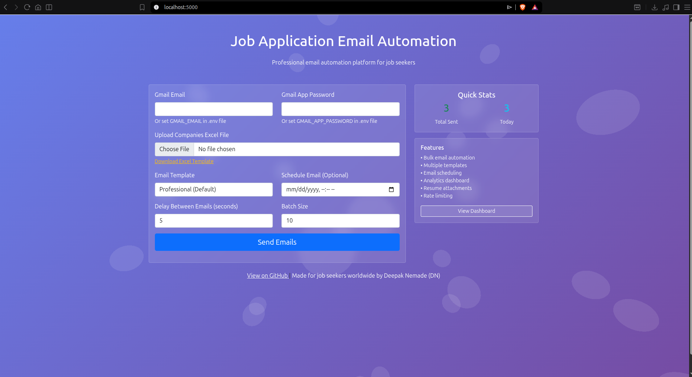
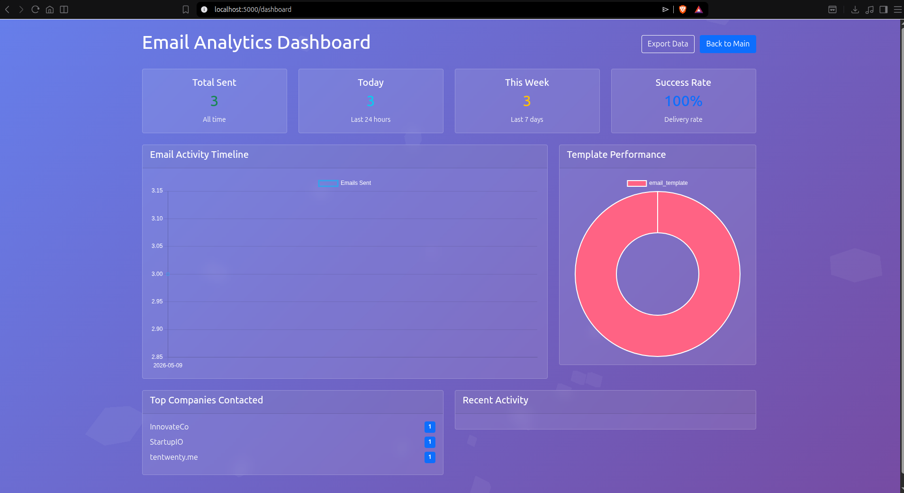
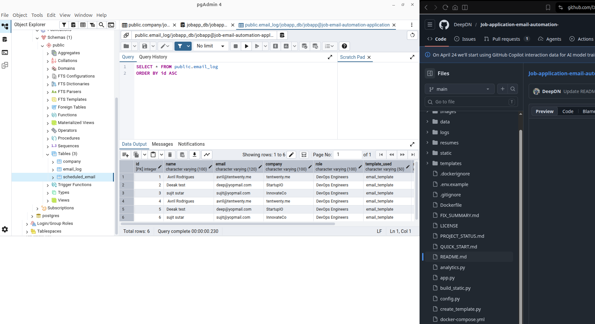

# Job Application Email Automation

[](https://github.com/DeepDN/Job-application-email-automation-/actions/workflows/deploy.yml)
[](https://opensource.org/licenses/MIT)
[](https://www.python.org/)
[](https://flask.palletsprojects.com/)

> Automate personalized job application emails with resume attachments, status tracking, and analytics — completely free and open source.

---
## Table of Contents

- [Overview](#overview)
- [Features](#features)
- [Quick Start](#quick-start)
- [Setup Guide](#setup-guide)
- [Configuration](#configuration)
- [Project Structure](#project-structure)
- [Deployment](#deployment)
- [Security](#security)
- [Contributing](#contributing)
- [License](#license)

---

## Overview

Job Application Email Automation is a self-hosted tool designed to eliminate the repetitive work of sending job application emails. It allows you to manage a list of recruiter contacts in Excel, attach role-specific resumes, and dispatch personalized emails in bulk — all from a clean web interface or the command line.

No subscriptions. No data sent to third parties. Everything runs on your own machine.

---








## Features

| Category | Capability |
|---|---|
| Email Delivery | Bulk sending with per-recipient personalization |
| Attachments | Role-based resume selection per row |
| Contact Management | Excel-driven workflow with auto status updates |
| Deliverability | Built-in rate limiting to avoid spam filters |
| Templates | Professional, Casual, Formal, and Creative presets |
| Scheduling | Send emails at a configured time |
| Tracking | Timestamped logs for all sent emails |
| Validation | Email address validation before dispatch |
| Analytics | Interactive dashboard for send performance |
| Interface | Web UI with Three.js animations, plus CLI support |

---

## Quick Start

**Hosted version (no setup required)**
[https://deepdn.github.io/Job-application-email-automation-/](https://deepdn.github.io/Job-application-email-automation-/)


### Option 2: Docker (Recommended for Production)

**Docker**

```bash
git clone https://github.com/DeepDN/Job-application-email-automation-.git
cd Job-application-email-automation-
cp .env.example .env
# Configure credentials in .env
docker-compose up -d
```

Open [http://localhost:5000](http://localhost:5000) in your browser.

---

## Setup Guide

### 1. Gmail Authentication

This tool uses Gmail App Passwords for secure authentication.

1. Enable 2-Step Verification on your Google account
2. Navigate to [Google Account → Security → App Passwords](https://myaccount.google.com/apppasswords)
3. Create a new app password under the "Mail" category
4. Copy the generated 16-character password — you will need it in the next step

> Your main Google account password is never used or stored.

---

### 2. Contact List (Excel)

Create an `.xlsx` file with the following columns:

| Column | Required | Description |
|---|---|---|
| `Name` | Yes | Recruiter or HR contact name |
| `Email` | Yes | Recipient email address |
| `Company` | Yes | Company name for personalization |
| `Role` | Yes | Job title being applied for |
| `Resume` | Yes | PDF filename from the `resumes/` folder |
| `Status` | No | Leave blank — auto-filled as "Sent" |

**Example:**

| Name | Email | Company | Role | Resume | Status |
|---|---|---|---|---|---|
| John Smith | john@techcorp.com | TechCorp | DevOps Engineer | resume_devops.pdf | |
| Sarah Lee | sarah@startup.io | StartupIO | Frontend Developer | resume_frontend.pdf | |

---

### 3. Resume Files

Place all resume PDFs inside the `resumes/` directory. File names must match exactly what is listed in the Excel sheet.
```text
resumes/
├── resume_devops.pdf
├── resume_frontend.pdf
└── resume_data_science.pdf
```

---

### 4. Email Template

Edit `templates/email_template.html` to write your application message. The template supports dynamic variables for name, company, and role.

---

## Configuration

### Environment Variables

Copy the example file and fill in your credentials:

```bash
cp .env.example .env
```

```env
SECRET_KEY=your-secret-key-change-in-production
GMAIL_EMAIL=your-email@gmail.com
GMAIL_APP_PASSWORD=your-16-character-app-password
DATABASE_URL=postgresql://jobapp:password@db:5432/jobapp_db
```

### Application Config (`config.py`)

```python
class Config:
    SECRET_KEY = 'your-secret-key'
    MAX_CONTENT_LENGTH = 16 * 1024 * 1024  # 16 MB upload limit
```

---

## Project Structure
```
Job-application-email-automation-/
├── app.py                     # Flask web application
├── email_sender.py           # Email sending logic
├── config.py                 # Configuration settings
├── send_emails.py           # Original CLI script
├── build_static.py          # Static site generator
├── requirements.txt         # Python dependencies
├── templates/
│   ├── index.html          # Web interface
│   └── email_template.html # Email template
├── static/
│   └── template.xlsx       # Excel template download
├── resumes/                # Your resume files
├── data/                   # Excel data files
├── logs/                   # Email logs
├── uploads/                # Uploaded files (web)
└── .github/
    └── workflows/
        └── deploy.yml      # GitHub Actions
```

---

## Deployment

### Docker (Recommended)

```bash
# Build and start all services
docker-compose up --build -d

# Stream application logs
docker-compose logs -f app

# Stop all services
docker-compose down
```

**Database management:**

```bash
# Backup
docker-compose exec db pg_dump -U jobapp jobapp_db > backup.sql

# Restore
docker-compose exec -T db psql -U jobapp jobapp_db < backup.sql
```
**Verify Database:**

Check stored data:
```bash
docker compose exec db psql -U jobapp -d jobapp_db -c "SELECT * FROM email_log;"
```

**Persistent volumes:**

| Volume | Purpose |
|---|---|
| `./uploads` | Uploaded Excel contact files |
| `./resumes` | Resume PDF files |
| `./logs` | Application and send logs |
| `postgres_data` | PostgreSQL database data |

---

### Local Installation

```bash
git clone https://github.com/DeepDN/Job-application-email-automation-.git
cd Job-application-email-automation-

python3 -m venv venv
source venv/bin/activate          # Windows: venv\Scripts\activate

pip install -r requirements.txt

cp .env.example .env              # Configure your credentials

python app.py
```

---

### Command Line Only

```bash
# After completing local installation above:
# Add your credentials directly in send_emails.py
python send_emails.py
```

---

## Security

| Aspect | Implementation |
|---|---|
| Credential storage | No passwords or emails are ever persisted |
| Data processing | All operations run locally on your machine |
| Authentication | Gmail App Passwords (isolated from your main password) |
| Spam prevention | Configurable rate limiting between sends |
| Transparency | Full source code available for audit |

---

## Contributing

Pull requests are welcome. For significant changes, please open an issue first to discuss the proposed approach.

**Getting started:**

```bash
git clone +git clone https://github.com/DeepDN/Job-application-email-automation-.git
cd Job-application-email-automation-

python3 -m venv venv
source venv/bin/activate

pip install -r requirements.txt
python -m pytest
```

1. Fork the repository
2. Create a branch: `git checkout -b feature/your-feature-name`
3. Commit your changes with clear messages
4. Open a pull request against `main`

---

## Support

| Type | Link |
|---|---|
| Bug Reports | [GitHub Issues](https://github.com/DeepDN/Job-application-email-automation-/issues) |
| Feature Requests | [GitHub Discussions](https://github.com/DeepDN/Job-application-email-automation-/discussions) |

---

## License

Distributed under the MIT License. See [LICENSE](LICENSE) for full terms.

---

<sub>Developed and maintained by <strong>Deepak Nemade (DN)</strong></sub>
